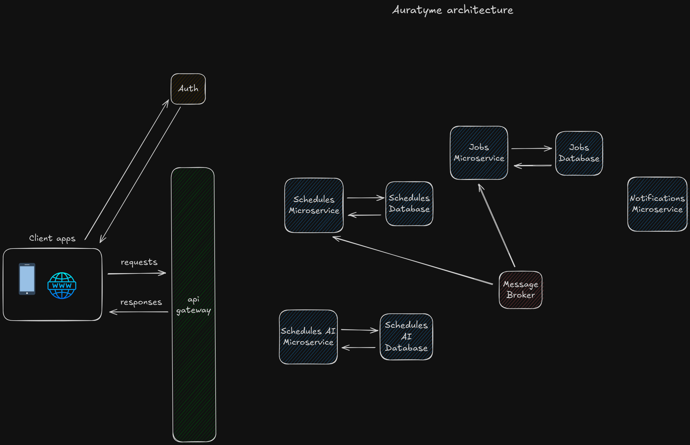

# Architecture

Auratyme is a system composed of several microservices communicating with each other. Some services take care of domain functionality, that will be delivered to end users (like managing schedules) and some are infrastructure services like message broker or api gateway. Look at the diagram below and read the description to better understand the structure.

As you can see every request that goes to backend is going through api gateway, which is also a load balancer and prevents accidentally leaking internal information to the outside world. When it comes to services, we can divide them into two groups: domain and infrastructure. On the diagram above domain services are: Schedules Service, Schedules AI Service and Notifications Service, rest (api gateway, message broker, auth, jobs service) are infrastructure services. Here is a brief explanation of each service.

Schedules Service - Heart of Auratyme, responsible for basic, but essential functionality - managing tasks and schedules (creating, reading, updating, deleting)

Schedules AI Service - This service makes Auratyme shine, it is reponsible for generating schedules for users using AI and data (global and provided by users)

Notifications Service - Service which for now is only responsible for sending push notifications, but other types will be supported in the future.

Jobs Service - Infrastructure service, which responsibility is scheduling jobs. They can be either single or recurring. Whenever any service needs to schedule a job, it sends request to this service.

Message Broker - enables asynchronous communication and decouples services.

Api Gateway - Routes, load balances and hides internal services.

Auth service - External auth provider. Takes care of authentication and authorization

Most of domain services also have databases.

To see common workflows happening in the system, see [workflows](./workflows/).
